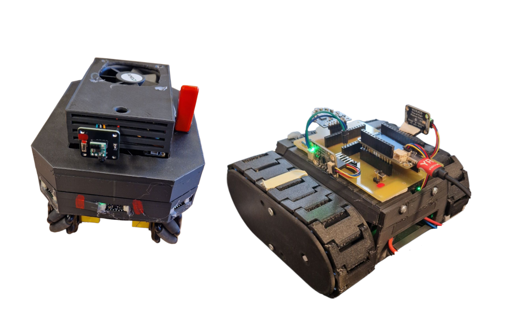
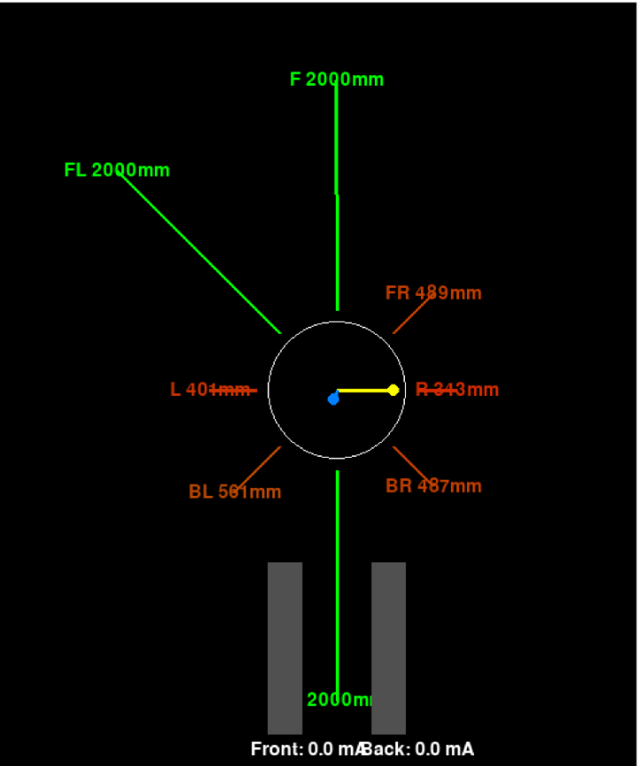
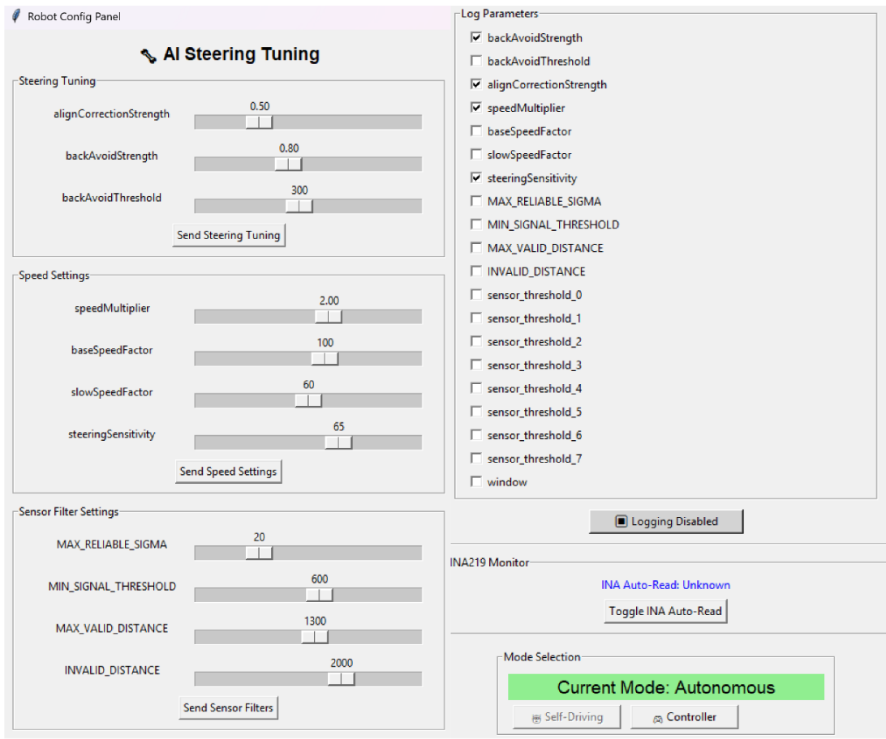

# RoboRacer

## 📄 [Download the full report: Report ghost divsion.pdf](./Report%20ghost%20divsion.pdf)

Welcome to the RoboRacer project! This repository contains the full stack for the Omnix robot platform, including embedded firmware, Python-based visualization and configuration tools, and supporting documentation.

---

## Project Images

### Robots

### Visualizer Example

### Configuration GUI

---

# Omnix Overview

The `omnix` robot is a core vehicle in the RoboRacer project, equipped with omni wheels for enhanced maneuverability. It handles sensor management, motor control, AI steering, and wireless communication, and is supported by a Python toolkit for visualization and configuration.

---

## Directory Structure

- **`ai.cpp` / `ai.h`**: AI steering logic for autonomous navigation.
- **`controller.cpp` / `controller.h`**: Gamepad/controller input management.
- **`globals.cpp` / `globals.h`**: Global variables and constants.
- **`imu.cpp` / `imu.h`**: IMU (Inertial Measurement Unit) initialization and data reading.
- **`interrupts.cpp` / `interrupts.h`**: Sensor interrupt configuration and management.
- **`motors.cpp` / `motors.h`**: Motor initialization and control.
- **`mux.cpp` / `mux.h`**: I2C multiplexer for sensor communication.
- **`params.cpp` / `params.h`**: Steering and sensor parameter management.
- **`sensors.cpp` / `sensors.h`**: Sensor initialization, reading, and management.
- **`tasks.cpp` / `tasks.h`**: FreeRTOS tasks for sensors, motors, and logic.
- **`udp_handler.cpp` / `udp_comm.h`**: UDP communication for parameters and telemetry.
- **`udp_sender.cpp`**: Telemetry data transmission over UDP.
- **`wifi_setup.cpp` / `wifi_setup.h`**: WiFi and UDP setup.
- **`xshut.cpp` / `xshut.h`**: Sensor power control via GPIO.
- **`omnix_py/`**: Python scripts for visualization, configuration, and debugging.

---

## Python Toolkit Overview

The `omnix_py` directory provides Python scripts that complement the robot's firmware:

- **`main.py`**: Entry point for the Python tools (UI and visualizer).
- **`udp_comm.py`**: UDP communication for telemetry and commands.
- **`ui.py`**: Tkinter-based GUI for parameter tuning and monitoring.
- **`visualizer.py`**: Pygame-based visualization of sensor and IMU data.
- **`config.py`**: Shared configuration (ports, IPs, parameters).
- **`logger.py`**: Telemetry and sensor data logging to CSV.

---

## Key Features

- **Omni Wheels**: Smooth, precise movement in any direction.
- **Sensor Management**: Multiple VL53L4CD sensors via I2C multiplexers.
- **Motor Control**: Smooth updates and autonomous driving logic.
- **AI Steering**: Wall centering, curve anticipation, and obstacle avoidance.
- **Wireless Communication**: Real-time telemetry and parameter updates via UDP.
- **IMU Integration**: Acceleration, gyroscope, and temperature data.
- **Python Tools**: UI for parameter tuning and real-time telemetry visualization.

---

## Setup Instructions

1. Initialize the I2C buses and configure the multiplexer.
2. Set up sensors, motors, and WiFi.
3. Start FreeRTOS tasks for sensor reading, motor control, and auxiliary logic.
4. Run the Python tools using `python3 main.py` in the `omnix_py` directory.

---

## Usage

- **Autonomous Mode**: AI steering logic controls the motors based on sensor data.
- **Controller Mode**: Use a gamepad for manual control.
- **Python Tools**: Tune parameters and monitor telemetry in real time.

---

## Dependencies

- [ArduinoJson](https://arduinojson.org/)
- [Adafruit Motor Shield Library](https://github.com/adafruit/Adafruit_Motor_Shield_V2_Library)
- [Adafruit LSM6DSOX Library](https://github.com/adafruit/Adafruit_LSM6DSOX)
- [Bluepad32](https://github.com/ricardoquesada/Bluepad32)
- [VL53L4CD Library](https://github.com/stm32duino/VL53L4CD)
- **Python**: Requires Python 3.8+ with the following libraries:
  - `pygame`
  - `tkinter`
  - `socket`
  - `json`
  - `csv`
